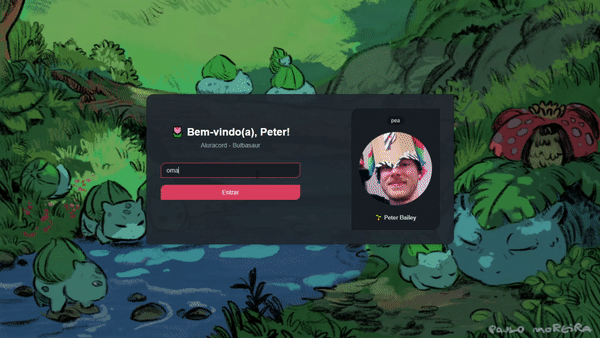

# 🌷 Aluracord - Bulbasaur theme
💻 <em>Projeto desenvolvido durante a Imersão React da Alura.</em>

#### 🔗 Confira em: https://aluracord-bulbasaur.vercel.app/
 

___

- 🐱‍💻 Chat em tempo real, customizado com o tema Bulbasaur, desenvolvido com Next.js e React.js.
- 📗 O usuário pode se conectar ao chat utilizando seu username do GitHub, com informações obtidas via REST API. 
- 🧰 Foram utilizados componentes da biblioteca SkynexUI para a criação das páginas e o Supabase como <em>back-end as a service</em>, a fim de armazenar as mensagens e possibilitar o <em>real time</em>.

